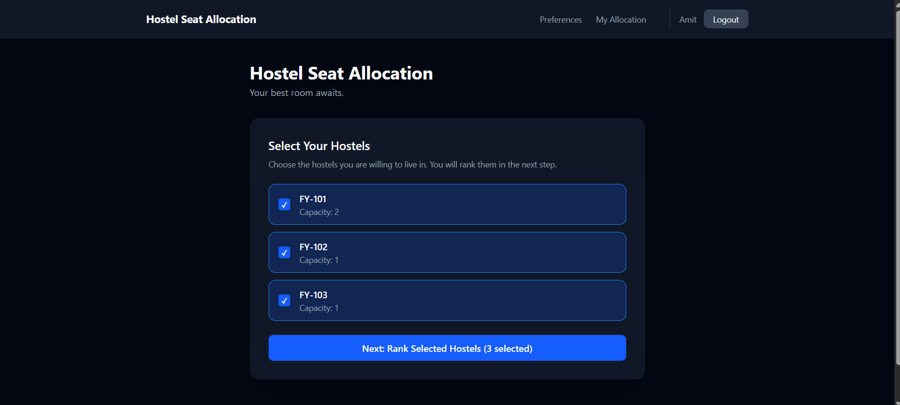
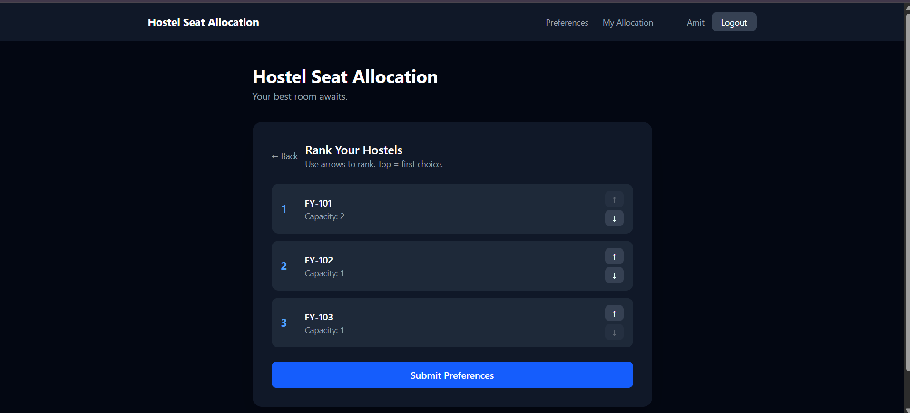
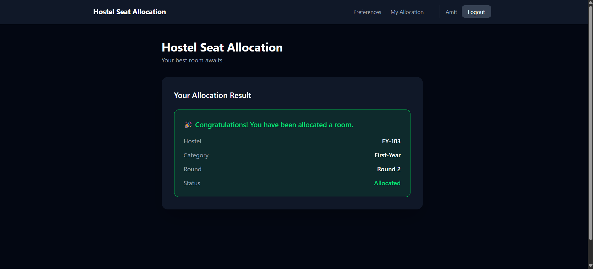
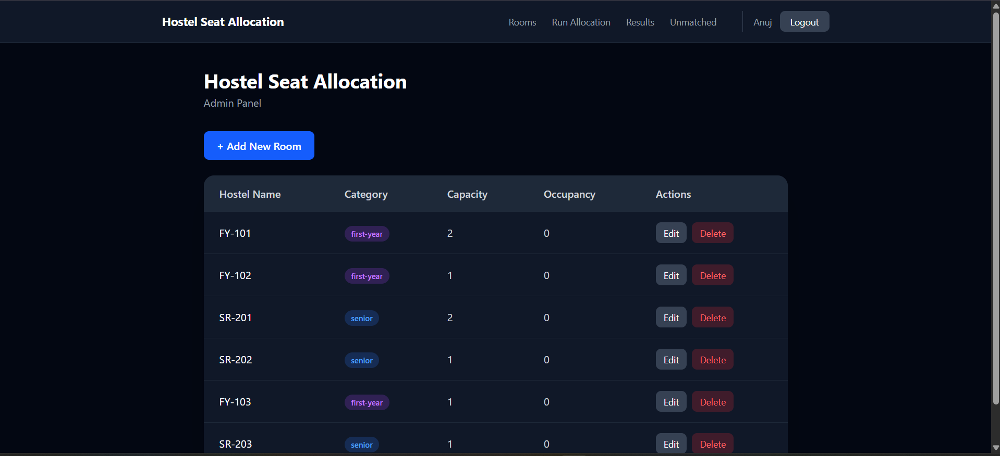
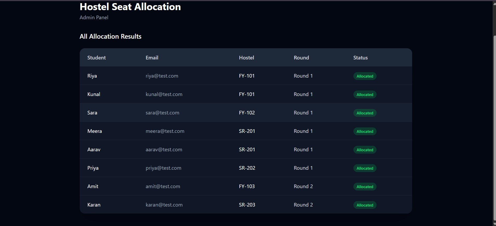

# 🏠 Hostel Seat Allocation System

A full-stack web application that allocates hostel rooms to students using the **Gale-Shapley stable matching algorithm** — the same class of algorithm behind the National Resident Matching Program (which matches medical residents to hospitals in the US) and Nobel Prize–winning work in market design.

Built solo as a portfolio project to demonstrate algorithmic thinking, full-stack engineering, and the ability to design, debug, and ship a real deployed system end-to-end.

**🔗 Live app:** [hostel-seat-allocation.vercel.app](https://hostel-seat-allocation.vercel.app)
**🔗 API:** [hostel-seat-allocation.onrender.com](https://hostel-seat-allocation.onrender.com)
**🔗 Repo:** [github.com/Anuj8506/hostel-seat-allocation](https://github.com/Anuj8506/hostel-seat-allocation)

> ⚠️ **Cold start note:** The backend is hosted on Render's free tier, which spins down after periods of inactivity. The **first request after idle time can take 30–50 seconds** to wake the server up. Subsequent requests are fast. If the app seems stuck on first load, give it a moment — it's not broken, just waking up.

---

## 📸 Screenshots

| Select Hostels | Rank Hostels |
|:---:|:---:|
|  |  |

| Allocation Result |
|:---:|
|  |

| Admin Room Management | Admin Allocation Results |
|:---:|:---:|
|  |  |

---

## 🧭 Why this project

Every year, colleges face the same problem: N students, M hostel rooms, everyone has preferences, capacity is limited, and someone has to decide who gets what — fairly. Most systems solve this with first-come-first-served or manual admin decisions, both of which are easy to game or simply unfair.

This project treats it as what it actually is: a **two-sided matching problem**, and solves it with an algorithm that's mathematically guaranteed to produce a **stable matching** — no student and hostel room would both prefer each other over their current assignment.

---

## ⚙️ Tech Stack

| Layer | Technology |
|---|---|
| Frontend | React (Vite), React Router, Axios |
| Backend | Node.js, Express |
| Database | MongoDB Atlas |
| Auth | Stateless JWT |
| Deployment | Vercel (frontend) + Render (backend) |

---

## 🧠 The Algorithm: Gale-Shapley Stable Matching

### The concept

Gale-Shapley solves the **stable marriage problem**: given two groups where each member ranks the other group by preference, find a matching where no two participants would rather be matched to each other than to their current match. That property is called **stability**, and it's what makes the algorithm fair in a way naive approaches (like first-come-first-served) aren't.

### Why it fits hostel allocation

- Students have preferences over hostel rooms/blocks.
- Rooms (via the admin/institution) have an implicit ranking of students, based on merit — for this system, **12th percentage** for first-years and **CGPA** for seniors (years 2–4).
- Both sides "propose" and "reject" until every match is stable — nobody is left wishing they'd swapped.

This project runs **two independent Gale-Shapley pools**:
1. **First-year pool** — students ranked by 12th percentage (0–100)
2. **Senior pool (years 2–4)** — students ranked by CGPA × 10 (normalized to a 0–100 scale)

The pools never compete with each other for rooms — each category of room only matches within its own pool, so a strong senior can't crowd out a first-year for a first-year room, and vice versa.

### Algorithm walkthrough (student-proposing version)

1. Every unmatched student proposes to their **top remaining choice** of room.
2. Each room compares all students currently proposing to it (plus anyone it's already provisionally holding) and keeps its **highest-ranked students up to capacity**, rejecting the rest.
3. Rejected students cross that room off their list and propose to their next choice in the following round.
4. Repeat until every student is either matched or has been rejected by every room on their preference list.

**Worked example:**

Say Room A (capacity 1) is preferred by Students X and Y. X has a 95% (12th), Y has an 88%.
- Round 1: Both X and Y propose to Room A (their top choice).
- Room A can only hold 1 student, so it provisionally holds X (higher score) and rejects Y.
- Round 2: Y proposes to their next-choice room (say Room B), which has space, so Y is provisionally held there.
- No further rejections occur — the matching is now **stable**: X can't do better than Room A, and Y isn't rejected by anyone with room left to accept them over Y.

**Complexity:** O(n²) in the worst case (n students, n rooms) — every student may propose to every room once before the algorithm terminates. For a hostel-scale problem (hundreds of students, tens of rooms), this runs essentially instantly.

**Implementation:** [`backend/src/algorithms/galeShapley.js`](./backend/src/algorithms/galeShapley.js) — returns `{ studentMatch, hostelHoldings, unmatchedStudents }`. Tested against hand-traced cases (4-student/2-hostel, 5-student unmatched scenario, and 3 additional edge cases) in [`test.js`](./backend/src/algorithms/test.js) and [`edgeTestCase.js`](./backend/src/algorithms/edgeTestCase.js).

### Two-round matching

Not everyone gets matched in Round 1 (rooms run out, or preferences don't align). So:
- **Round 1:** Full pool of students vs. full room capacity.
- **Round 2:** Any unmatched students from Round 1 get a fresh, scoped preference form (only showing rooms with remaining capacity) and are matched again via a second, independent Gale-Shapley run.
- **Manual review fallback:** Anyone still unmatched after Round 2 is flagged for manual admin review rather than silently left in limbo.

---

## 🏗️ Architecture Highlights

A few design decisions worth calling out (the kind of thing that comes up in an interview):

- **Single `Room` model with a `category` field** (`'first-year'` / `'senior'`) instead of two separate models — same shape of data, differentiated by a field rather than duplicated schemas.
- **Preference history is preserved** — a new `Preference` document is created for each round rather than overwriting the previous one, so the full decision trail is auditable.
- **`isAdmin` flag on the `Student` model** rather than a separate `Admin` model — simpler for a system with only one role distinction, with admin bootstrap handled by registering normally and flipping the flag directly in MongoDB Atlas (documented as an intentional, interview-defensible tradeoff, not an oversight).
- **Sentinel document pattern for Round 2's "already ran" guard** — rather than tracking round completion with a separate flag that could go stale, a sentinel `Allocation` document (`status: 'round2-complete'`) is written when Round 2 finishes, including when it produces zero new allocations. This closed a real bug: a naive "did any allocations get created?" check silently let Round 2 be re-triggered when it happened to match nobody.
- **Stateless JWT auth** — no server-side session store, which keeps the backend easy to scale horizontally (not that a portfolio project needs to scale, but the pattern is production-realistic).

---

## 🚀 Running Locally

```bash
git clone https://github.com/Anuj8506/hostel-seat-allocation.git
cd hostel-seat-allocation

# Backend
cd backend
npm install
# create a .env file (see .env.example) with MONGO_URI, JWT_SECRET, CLIENT_URL
npm run dev

# Frontend (in a new terminal)
cd frontend
npm install
# create a .env file with VITE_API_URL (no /api suffix)
npm run dev
```

### Admin Bootstrap

There's no public "make me an admin" endpoint (intentionally — see Architecture Highlights above). To create an admin account:
1. Register a normal student account through the app.
2. In MongoDB Atlas, open the `hostel-db` database → `students` collection.
3. Find your user document and set `isAdmin: true`.
4. Log out and back in to pick up the new token.

---

## 📋 Features

- Student registration & login (JWT auth)
- Branch validation against a configurable whitelist
- Two-step preference selection UI (select relevant hostels, then rank them — not forced to rank every option)
- Two-round Gale-Shapley allocation with pool separation by year group
- Manual review queue for students unmatched after both rounds
- Admin dashboard: room CRUD, trigger allocation rounds, view results, view unmatched students

---

## 🔮 Future Improvements

(Full list maintained in a local, gitignored `IMPROVEMENTS.md` as a deliberate scope-control parking lot. Highlights:)

- Dedicated admin-promotion endpoint (currently handled via direct DB edit — functional, but a proper endpoint would be the natural next step for a multi-admin institution)
- Branch-level CGPA normalization (accounting for grading differences across departments)
- Distance/location as an additional room-scoring factor (deferred since all hostels are on the same campus, and student preference ranking already implicitly captures proximity preference)

---

## 👤 About

Built by [Anuj](https://github.com/Anuj8506) as a solo portfolio project — full-stack implementation plus algorithmic design, testing, and cloud deployment, done independently from first commit to production.